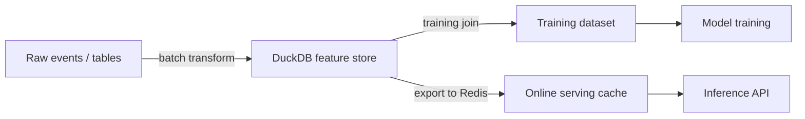

Feast and Tecton are powerful. They're also complex to operate. For teams with fewer than 20 features and one online serving backend, DuckDB + a few conventions gives you 80% of the value at 5% of the complexity.

## What a feature store actually needs to do

1. Compute features consistently between training and serving (training-serving skew is the biggest ML bug)
2. Point-in-time correct joins (no future leakage)
3. Some kind of online serving path for low-latency inference

## Point-in-time join with DuckDB

```python
import duckdb

# Feature history table has: entity_id, feature_value, valid_from
# Labels table has: entity_id, label, event_time

query = """
SELECT
    l.entity_id,
    l.label,
    l.event_time,
    f.feature_value
FROM labels l
ASOF JOIN feature_history f
  ON l.entity_id = f.entity_id
  AND l.event_time >= f.valid_from
"""

result = duckdb.sql(query).df()
```

DuckDB's `ASOF JOIN` is perfect for point-in-time lookups. No custom logic required.

## Mermaid: simple feature store architecture



## Online serving: export to Redis

```python
import redis
import json

r = redis.Redis(host='localhost', port=6379)

# Push latest feature values for each entity
rows = duckdb.sql("""
  SELECT entity_id, feature_value
  FROM feature_history
  QUALIFY ROW_NUMBER() OVER (PARTITION BY entity_id ORDER BY valid_from DESC) = 1
""").fetchall()

for entity_id, feature_value in rows:
    r.set(f"feat:{entity_id}", json.dumps({"value": feature_value}))
```

## What went wrong

Forgot to partition feature exports by entity type — ended up with key collisions in Redis. Add entity type prefix to all keys: `feat:{entity_type}:{entity_id}`.

## When to upgrade to Feast

- More than 50 features
- Multiple teams consuming the same features
- Need feature lineage and governance

## Checklist

- [ ] Use `ASOF JOIN` for all training dataset creation
- [ ] Version feature definitions in a separate YAML or Python file
- [ ] Automate Redis sync on a schedule (daily or hourly)
- [ ] Validate feature distributions don't drift between training and serving
