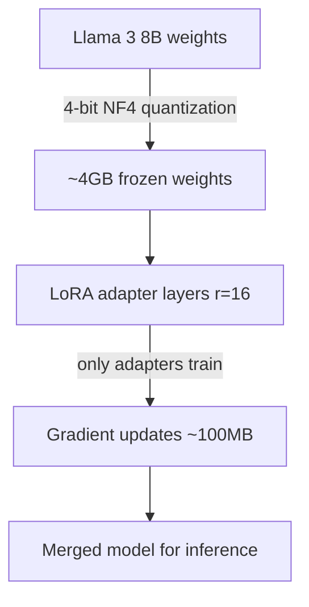

Full fine-tuning Llama 3 8B needs ~160GB VRAM. QLoRA gets it to 24GB. Here's the full setup that actually worked on an RTX 4090.

## Environment

Python 3.11, transformers 4.40, peft 0.10, bitsandbytes 0.43, CUDA 12.1, RTX 4090 24GB

## Install

```bash
pip install transformers peft bitsandbytes accelerate datasets trl
```

## Load model in 4-bit

```python
from transformers import AutoModelForCausalLM, BitsAndBytesConfig
import torch

bnb_config = BitsAndBytesConfig(
    load_in_4bit=True,
    bnb_4bit_quant_type="nf4",
    bnb_4bit_compute_dtype=torch.bfloat16,
    bnb_4bit_use_double_quant=True,
)

model = AutoModelForCausalLM.from_pretrained(
    "meta-llama/Meta-Llama-3-8B-Instruct",
    quantization_config=bnb_config,
    device_map="auto",
)
```

## Apply LoRA adapters

```python
from peft import LoraConfig, get_peft_model, prepare_model_for_kbit_training

model = prepare_model_for_kbit_training(model)

lora_config = LoraConfig(
    r=16,
    lora_alpha=32,
    target_modules=["q_proj", "v_proj"],
    lora_dropout=0.05,
    bias="none",
    task_type="CAUSAL_LM",
)

model = get_peft_model(model, lora_config)
model.print_trainable_parameters()
# trainable params: 4,194,304 || all params: 8,034,045,952 || trainable%: 0.052
```

## Training loop with TRL SFTTrainer

```python
from trl import SFTTrainer
from transformers import TrainingArguments

training_args = TrainingArguments(
    output_dir="./llama3-finetuned",
    num_train_epochs=3,
    per_device_train_batch_size=2,
    gradient_accumulation_steps=4,
    learning_rate=2e-4,
    bf16=True,
    logging_steps=10,
)

trainer = SFTTrainer(
    model=model,
    train_dataset=dataset,
    args=training_args,
    dataset_text_field="text",
    max_seq_length=2048,
)

trainer.train()
```

## Mermaid: QLoRA memory flow



## What went wrong

First run: CUDA OOM at batch 1. Root cause: forgot `gradient_checkpointing_enable()`. Add this before training and VRAM drops from 22GB to 16GB peak.

```python
model.gradient_checkpointing_enable()
```

## Checklist

- [ ] Enable `gradient_checkpointing` before training
- [ ] Use `bf16=True` not `fp16` on Ampere+ GPUs
- [ ] Save only the LoRA adapter, not the full model
- [ ] Evaluate with `lm-evaluation-harness` on held-out set
